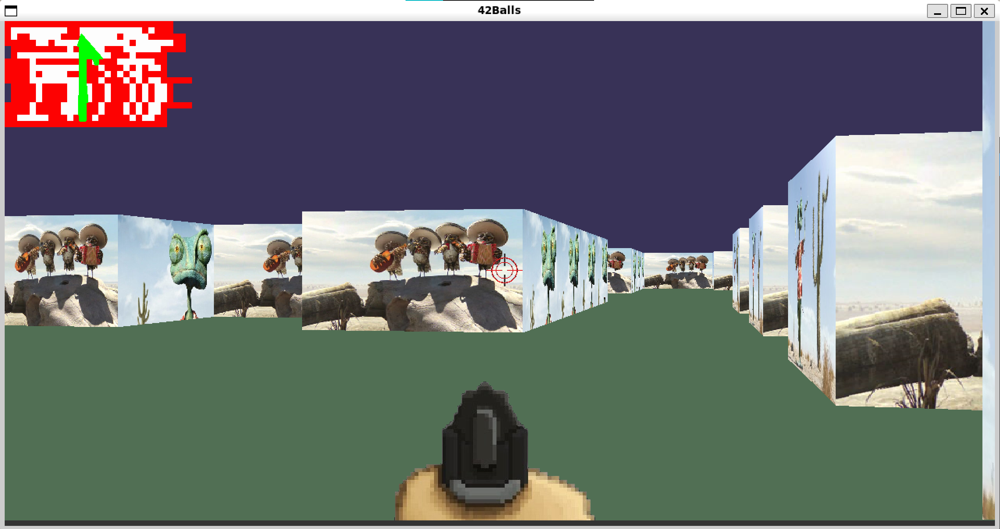

# cub3D

## Overview
🎯 **cub3D** is a graphical pseudo-3D game inspired by *Wolfenstein 3D*, developed in C using the **MLX graphical library** as part of the 42 School curriculum. The project demonstrates raycasting techniques to render a first-person perspective.

## 🕹️ Features
- **Parsing:** Reads and interprets a map file defining walls and player positions.
-  **Raycasting Algorithm:** Implements a raycasting engine to create a 3D effect using a 2D map.
- **Texture Mapping:** Applies textures to walls using pixel manipulation for a realistic appearance.
- **Bonus Features:** Includes a **minimap** for navigation and **sprites**, including a player's gunshot animation.

## 🛠️ Installation & Usage
### Prerequisites
- **MLX Library** (MinilibX)
- **gcc or clang** compiler
- **Make** utility

### Installation
```bash
# Clone the repository
git clone https://github.com/hienptx/cub3D.git
cd cub3D

# Compile the project
make

# Compile the project with bonus
make bonus

# Run the gamel like in Demo
./cub3D maps/2.cub
```

## 🎥 Screenshots & Video Demo


[Watch the Demo](https://youtu.be/EVUZNPmnXw8)

## 🎮 Controls
- **W / A / S / D** - Move forward, left, backward, right
- **Left / Right Arrow** - Rotate camera
- **ESC** - Exit game
### Controls with bonus
- **SPACE** - Shooting

## 📑 Code Structure
- **main.c** - Entry point, initializes game
- **parsing/** - Handles map loading and validation
- **raycasting/** - Implements the raycasting algorithm
- **rendering/** - Manages drawing and textures

## 🔍 Sorting Strategy
**Sorting Algorithms Used:**
- **Bubble Sort** is used for sorting ray distances to handle correct rendering order.
- **Quick Sort** optimizes performance for larger datasets in sprite rendering.
- **Insertion Sort** is applied to ensure small updates are efficient when managing game objects.

## 🏗️ Challenges & Learnings
- Implementing an efficient **raycasting engine**.
- Handling **pixel rendering and texture mapping**.
- Parsing and validating **custom map formats**.

## Contributors
- 👤 [Hien Pham](https://github.com/hienptx)
- 👤 [Dongjub Lee](https://github.com/dongjle2)

## License
📜 This project is licensed under the MIT License - see the LICENSE file for details.

